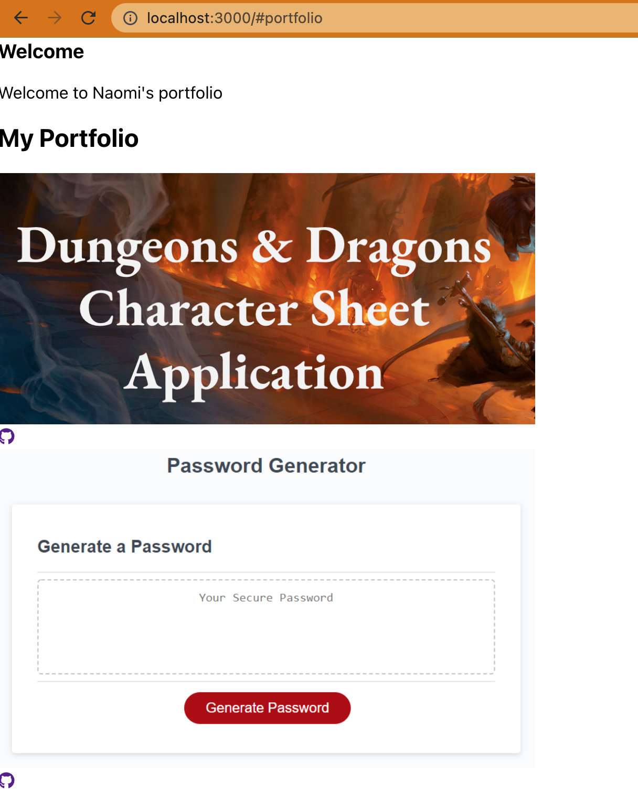

# Getting Started with Create React App

## Description

This project was bootstrapped with [Create React App](https://github.com/facebook/create-react-app).

[View my unsuccessful deployment here.](https://lizard-blizzard.herokuapp.com/)

I actually really liked this project! Making a portfolio can kind of be a drag but I learned a lot from this project. I must admit my portfolio is unfinished (not deployable and no styling). I am submitting this in the hope of getting some partial credit! I will be styling this to use as my portfolio for job searching.

See my ```heroku logs --tail``` below for an insight into my deployment errors.


## Mockup





## Grading Requirements
```
Technical Acceptance Criteria: 40%
Satisfies all of the preceding acceptance criteria plus the following:
Application must use React to render content.
Application has a single Header component that appears on multiple pages, with a Navigation component within it that’s used to conditionally render About Me, Portfolio, Contact, and Resume sections.
Application has a single Project component that’s used multiple times in the Portfolio section.
Application has a single Footer component that appears on multiple pages.
Application must be deployed to GitHub Pages.

Deployment: 32%
Application deployed at live URL.
Application loads with no errors.
Application GitHub URL submitted.
GitHub repository contains application code.

Application Quality: 15%
User experience is intuitive and easy to navigate.
User interface style is clean and polished.
Application uses a color scheme other than the default Bootstrap color palette.

Repository Quality: 13%
Repository has a unique name.
Repository follows best practices for file structure and naming conventions.
Repository follows best practices for class/id naming conventions, indentation, quality comments, etc.
Repository contains multiple descriptive commit messages.
Repository contains high-quality README file with description, screenshot, and link to deployed application.
```      

## Available Scripts

In the project directory, you can run:

### `npm start`

Runs the app in the development mode.\
Open [http://localhost:3000](http://localhost:3000) to view it in your browser.

### `npm test`

Launches the test runner in the interactive watch mode.\
See the section about [running tests](https://facebook.github.io/create-react-app/docs/running-tests) for more information.

### `npm run build`

Builds the app for production to the `build` folder.\
It correctly bundles React in production mode and optimizes the build for the best performance.

See the section about [deployment](https://facebook.github.io/create-react-app/docs/deployment) for more information.

### `npm run eject`